# V3Cell: A Vision-Guided Virtual 3D Cell Framework for Phenotypic Modeling and Perturbation Prediction

**Authors:**
Lu You¹˙², Xun Deng¹˙², Chenke Xu³, Xiaobo Zhu¹˙², Zhigang Zhang¹˙², Pengyu Chen¹˙², Xiwen Yang¹˙²,
Zhengzheng Yan⁶, Jiahua Rao⁷, Huili Hu⁴˙⁵, Jianying Hu³, and Pengwei Hu¹˙²*

¹ Xinjiang Technical Institute of Physics and Chemistry, Chinese Academy of Sciences, Urumqi, China<br>
² University of Chinese Academy of Sciences, Beijing, China<br>
³ Department of Environmental Science and Engineering, Fudan University, Shanghai, China<br>
⁴ The Key Laboratory of Experimental Teratology, Ministry of Education, Department of Systems Biomedicine, School of Basic Medical Sciences, Shandong University, Jinan, China<br>
⁵ Qilu Hospital, Cheeloo College of Medicine, Shandong University, Jinan, China<br>
⁶ Shenzhen Institutes of Advanced Technology, Chinese Academy of Sciences, Shenzhen, China<br>
⁷ School of Computer Science and Engineering, Sun Yat-sen University, Guangzhou, China

*Correspondence: hpw@ms.xjb.ac.cn

---

<p align="center">
  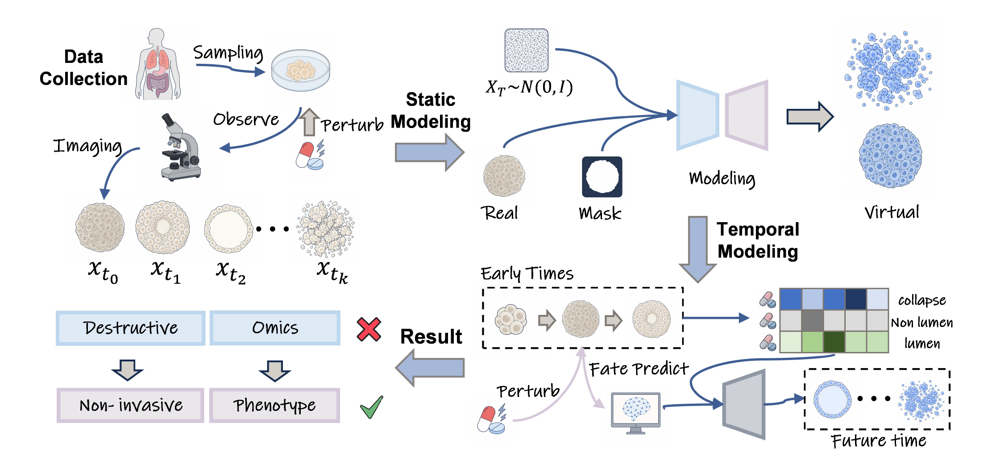
</p>

## 📝 Introduction

V3Cell is a two stage, vision guided framework that constructs *in silico* surrogates of organoids directly from non invasive brightfield microscopy, without requiring omics profiling or fluorescent labeling. Stage 1 builds **static virtual 3D cells** across multiple organoid lineages, including colon, stomach, and lung, with each lineage spanning several morphological phenotype classes (4 colon, 3 stomach, and 2 lung classes), using a foreground aware, class conditional GAN built on the [R3GAN](https://github.com/brownvc/R3GAN) architecture. Stage 2 builds a **temporal virtual organoid** for a separate hESC derived amniotic sac organoid system. Given only a short prefix of early observed frames, it predicts the developmental fate, namely cavity formation, cavity collapse, or non cavity, together with the full fate conditioned spatiotemporal trajectory, recapitulating real perturbation responses.

This repository contains the **core two stage model**, providing training and inference code for both stages, verified end to end on real checkpoints and datasets. Supplementary analysis and paper figure reproduction scripts, together with the drug conditioning extension, are maintained separately and are not part of this release.

---

## 📦 Getting Started

  

---

### • Environment Setup

```bash
# This creates an isolated environment to avoid conflicts with existing packages
conda create -n v3cell python=3.9
conda activate v3cell

# Clone this repository
git clone https://github.com/Laineyoulu/V3Cell.git
cd V3Cell

# Install PyTorch with CUDA (adjust the cuda version to match your driver)
pip install torch==2.5.1 torchvision==0.20.1 --index-url https://download.pytorch.org/whl/cu121

# Install the remaining dependencies
pip install -r requirements.txt
```

**Note:** the R3GAN custom CUDA ops (`bias_act`, `upfirdn2d`) are compiled on first run via `torch.utils.cpp_extension`. This requires a matching CUDA toolkit and a C++ compiler on the host.

### • Repository Structure

```
V3Cell/
├── configs/
│   └── default.yaml                  # Default Stage 2 hyperparameters
├── models/                           # Stage 2 model definitions
│   ├── video_generator.py            # V3CellGenerator (main model)
│   ├── motion_rnn.py                 # MotionRNN: temporal latent predictor (R_psi)
│   ├── encoder.py                    # SequenceEncoder + ImageEncoder
│   ├── discriminators.py             # ImageDiscriminator + VideoDiscriminator
│   ├── fate_classifier.py            # FateClassifier (Phi; frozen at inference)
│   └── temporal_organoid_generator/  # Self-contained, lineage-agnostic R3GAN
│                                     # network definitions, frozen and reused to
│                                     # decode each latent into an organoid frame
├── r3gan/                            # R3GAN training pipeline (Stage 1)
│   ├── train.py                      # R3GAN training entry point
│   ├── finetune_with_mask.py         # Foreground-aware fine-tuning
│   ├── dataset_tool.py               # Build a training .zip from a folder
│   ├── R3GAN/                        # Core generator/discriminator + trainer
│   ├── training/                     # Dataset, loss, training loop
│   └── metrics/                      # KID / IS / FID / precision-recall
├── training/                         # Stage 2 trainers
│   ├── conditional_trainer.py        # Stage 2 conditional trainer (used in the paper)
│   ├── trainer.py                    # Stage 2 unconditional trainer (ablation variant)
│   └── losses.py                     # All Stage 2 loss functions
├── scripts/
│   ├── train_conditional.py          # Stage 2 training entry point
│   ├── inference.py                  # Predict full trajectory from early frames
│   ├── generate.py                   # Batch video generation from a trained checkpoint
│   ├── generate_organoid_images.py   # Batch static image generation (Stage 1 only)
│   ├── train.py                      # Stage 2 unconditional training (ablation variant)
│   └── subsample_frames.py           # Frame down-sampling utility
├── data/
│   └── video_dataset.py              # Video frame dataset loader
├── dnnlib/                           # Utility library (from StyleGAN/R3GAN)
├── torch_utils/                      # Custom CUDA ops (from StyleGAN/R3GAN)
└── requirements.txt
```

### • Dataset Organization

**Stage 1 — static images**, packaged as a `.zip` in the R3GAN dataset format:

```
organoid.zip
├── 00000.png
├── 00001.png
├── ...
└── dataset.json     # {"labels": [[filename, class_idx], ...]}
```

Build this zip from a folder of images with:

```bash
python r3gan/dataset_tool.py --source /path/to/images --dest datasets/organoid.zip
```

**Stage 2 — early-frame videos**, one folder per organoid, grouped by fate class:

```
video_dataset/
├── lumen/
│   ├── video_001/
│   │   ├── frame_t000.png
│   │   ├── frame_t001.png
│   │   └── ...        # sequential frames, one folder per video
│   └── video_002/
├── lumen_collapse/
└── non_lumen/
```

### • Stage Dependency

Stage 2 decodes through a **frozen** Stage 1 generator — train (or obtain) a Stage 1 checkpoint *before* training or running Stage 2:

* **Stage 1 output**: `network-snapshot-XXXXXX.pkl`, produced by `r3gan/train.py`.
* **Stage 2 input**: pass that same `.pkl` as `--r3gan_ckpt` to every Stage 2 script.

---

## 🚀 V3Cell: Quick Usage Guide

V3Cell provides full support for training and inference at both stages. This guide walks through building a static virtual 3D cell generator (Stage 1), then a temporal virtual organoid constructor on top of it (Stage 2).

### • 📖 Stage 1: Static Virtual 3D Cell Generator

#### Step 1 — Train the foreground-aware R3GAN

```bash
cd r3gan

python train.py \
    --outdir=../training-runs \
    --data=../datasets/organoid.zip \
    --gpus=3 \
    --batch=96 \
    --preset=FFHQ-256 \
    --cond=True \
    --mirror=True \
    --aug=True \
    --kimg=5000 \
    --snap=10 \
    --metrics=fid50k_full
```

`--preset` must match your data resolution (e.g. `FFHQ-64` for 64×64 organoid crops, `FFHQ-256` for 256×256).

#### Step 2 — Foreground-aware fine-tuning (optional)

Sharpens the generator on the organoid region using binary foreground masks (mask-weighted R1/R2 penalty, λ_fg = 5.0 by default):

```bash
python finetune_with_mask.py \
    --resume ../training-runs/network-snapshot-XXXXXX.pkl \
    --data ../datasets/organoid.zip \
    --mask-path ../datasets/masks.zip \
    --outdir ../training-runs-finetuned \
    --foreground-weight 5.0 \
    --kimg 1000
```

#### Step 3 — Generate static virtual 3D cells

```bash
python gen_images.py \
    --network ../training-runs/network-snapshot-XXXXXX.pkl \
    --outdir ../outputs/static_samples \
    --seeds 0-99 \
    --class 0
```

#### Results

Static virtual 3D cells generated across the three lineages. Colon, stomach, and lung span 4, 3, and 2 morphological phenotype classes, and each example below is one class.

<table align="center">
  <tr>
    <th align="center" valign="middle">Colon</th>
    <td align="center" valign="middle">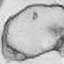</td>
    <td align="center" valign="middle">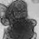</td>
    <td align="center" valign="middle">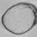</td>
    <td align="center" valign="middle">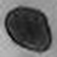</td>
  </tr>
  <tr>
    <th align="center" valign="middle">Stomach</th>
    <td align="center" valign="middle">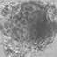</td>
    <td align="center" valign="middle">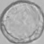</td>
    <td align="center" valign="middle">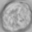</td>
  </tr>
  <tr>
    <th align="center" valign="middle">Lung</th>
    <td align="center" valign="middle">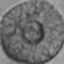</td>
    <td align="center" valign="middle">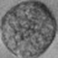</td>
  </tr>
</table>

---

### • 📖 Stage 2: Temporal Virtual Organoid Construction

#### Step 1 — Train the dynamic modeler

```bash
python scripts/train_conditional.py \
    --r3gan_ckpt training-runs/network-snapshot-XXXXXX.pkl \
    --data_dir datasets/video_dataset \
    --output_dir outputs/v3cell \
    --gpu 0,1,2,3 \
    --n_frames 25 \
    --n_condition_frames 6 \
    --batch_size 8 \
    --lambda_recon 10.0 \
    --lambda_adv 1.0 \
    --lambda_motion 0.1 \
    --lambda_mutual 1.0 \
    --total_kimg 5000
```

#### Step 2 — Predict the full trajectory from early frames

```bash
python scripts/inference.py \
    --checkpoint outputs/v3cell/checkpoint_XXXXXX.pt \
    --r3gan_ckpt training-runs/network-snapshot-XXXXXX.pkl \
    --test_dir datasets/video_dataset \
    --n_condition_frames 6 \
    --total_frames 25 \
    --output_dir outputs/predictions
```

Each held-out organoid produces a condition / predicted / real GIF triplet under `outputs/predictions/`.

#### Step 3 — Batch (unconditional) generation

```bash
python scripts/generate.py \
    --checkpoint outputs/v3cell/checkpoint_XXXXXX.pt \
    --r3gan_ckpt training-runs/network-snapshot-XXXXXX.pkl \
    --output_dir outputs/generated \
    --n_videos 50 \
    --n_frames 25 \
    --format gif
```

#### Results

Given only a short prefix of early observed frames, V3Cell constructs the full temporal virtual organoid for each of the three developmental fates. Each column is one fate, the top row is the real time lapse, and the bottom row is the virtual organoid built by V3Cell.

<table align="center">
  <tr>
    <td></td>
    <th align="center">Cavity formation</th>
    <th align="center">Cavity collapse</th>
    <th align="center">Non cavity</th>
  </tr>
  <tr>
    <th align="center" valign="middle">Real</th>
    <td align="center" valign="middle">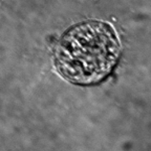</td>
    <td align="center" valign="middle">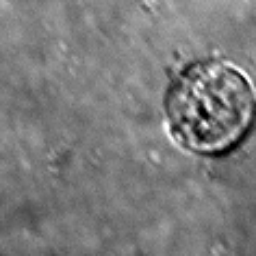</td>
    <td align="center" valign="middle">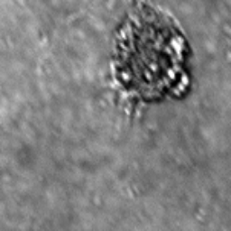</td>
  </tr>
  <tr>
    <th align="center" valign="middle">Virtual</th>
    <td align="center" valign="middle">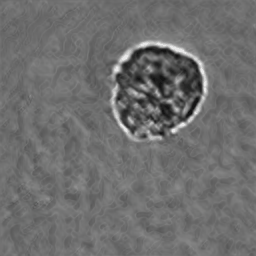</td>
    <td align="center" valign="middle">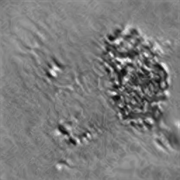</td>
    <td align="center" valign="middle">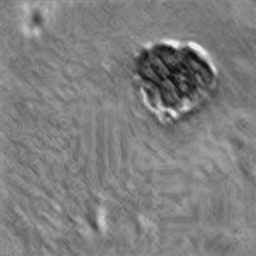</td>
  </tr>
</table>

---

## ⚖️ License

The original work in this repository (V3Cell source code, models, figures, and
documentation) is released under the
**[Creative Commons Attribution-NonCommercial 4.0 International License (CC BY-NC 4.0)](LICENSE)**
— you may share and adapt it for **non-commercial** research purposes with appropriate
credit. Commercial use is **not** permitted.

This repository also incorporates third-party components (notably NVIDIA StyleGAN3 /
R3GAN code under `dnnlib/`, `torch_utils/`, `r3gan/`, and
`models/temporal_organoid_generator/networks.py`) that retain their own licenses and are
**non-commercial / research-only**. These apply on top of the license above — see
**[`THIRD_PARTY_NOTICES.md`](THIRD_PARTY_NOTICES.md)**. For any use beyond non-commercial
academic research, you must obtain the appropriate rights from the respective copyright
holders (including NVIDIA CORPORATION).

## 📃 Citation

If you use this codebase in your research, please cite:

```bibtex
@article{you2026v3cell,
  title   = {V3Cell: A Vision-Guided Virtual 3D Cell Framework for Phenotypic Modeling and Perturbation Prediction},
  author  = {You, Lu and Deng, Xun and Xu, Chenke and Zhu, Xiaobo and Zhang, Zhigang and
             Chen, Pengyu and Yang, Xiwen and Yan, Zhengzheng and Rao, Jiahua and
             Hu, Huili and Hu, Jianying and Hu, Pengwei},
  year    = {2026},
  note    = {Manuscript in preparation},
  url     = {https://github.com/Laineyoulu/V3Cell}
}
```

This project builds on:
- [R3GAN](https://github.com/brownvc/R3GAN) — Regularized GAN with improved training stability
- [MoCoGAN-HD](https://arxiv.org/abs/2105.05298) — High-resolution video generation via image generators
